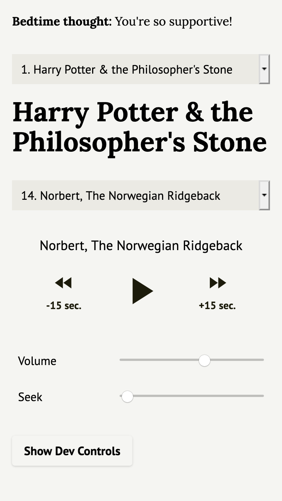

# Audio Player




## About

This is an audio book player made for a friend and I to use to fall asleep to. The user must first enter a positive affirmation, which will be displayed above the audio player. Different books and chapters can be selected for playback. Supports user preferred color scheme.

Uses:
- React
- [Tailwind Css](https://github.com/tailwindlabs/tailwindcss)
- [React Player](https://github.com/cookpete/react-player)

## ETL

The ETL (Extract Transform Load) converts audio file names into JSON, so I don't have to type in hundreds of chapter titles and urls. I'm not an expert at Bash so it's still super janky at the moment, but even in its current state, it's a gigantic time saver.

### Step 1

Each book should be a single directory of audio files—one for each chapter.

copy `bin/chapter-parser.sh` into each book directory

### Step 2

copy `bin/book-parser.sh` one level above the root directory of the book series and change line 11 to point at the book directory root.

Run it.

### Step 3

In each directory where you put the chapter parser script, there is now an `out.txt` file.

Copy the generated JSON data from `out.txt` into a file in this project `src/book-data.json` with the following JSON structure:

```json
{
  "series": "Book Series Title",
  "baseMediaUrl": "https://link.to.example.com/",
  "book": [
    {
      "title": "First Book Title",
      "url": "This_is-the-Directory-Name",
      "chapters": [
		  // out.txt goes here
	  ]
	},
	{
      "title": "Second Book Title",
      "url": "This_is-the-second-Directory-Name",
      "chapters": [
		  // out.txt goes here
	  ]
	}
}

```

Future versions of the ETL will handle book titles and urls, but for the meantime, that data has to be manually entered. Remember trailing commas are not valid in JSON.

## Install

```
npm install
npm start
```

## Build

```
npm build
```
