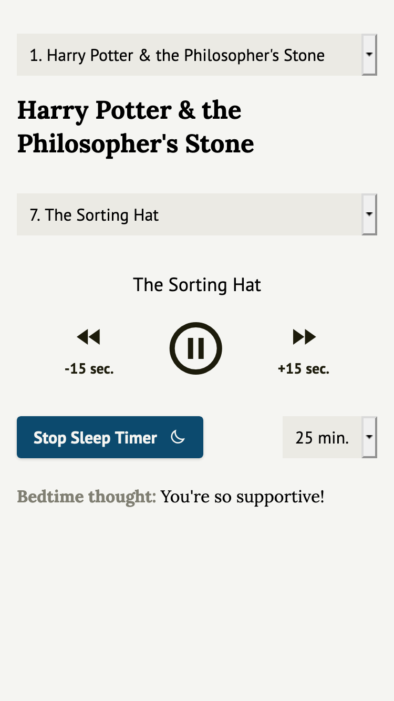

# Audio Player




## About

This is an audio book player made for a friend and I to use to fall asleep to. The user must first enter a positive affirmation, which will be displayed above the audio player. Different books and chapters can be selected for playback. Supports user preferred color scheme.

Uses:
- React
- [Tailwind Css](https://github.com/tailwindlabs/tailwindcss)
- [React Player](https://github.com/cookpete/react-player)

## Install

```
npm install
npm start
```

## Build

```
npm build
```
